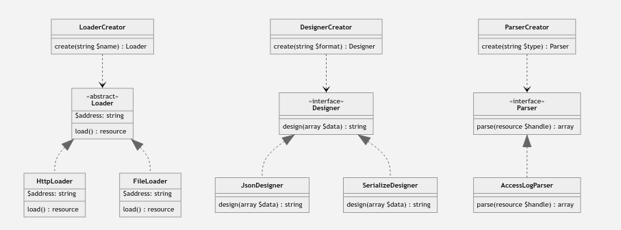

# Парсер
## Описание
Предложенный парсер позволяет разобрать информацию с помощью некоторого алгоритма и выдать сводную информацию в удобном формате. 
<br/>
Данные на вход парсера могут подаваться разными способами: из коробки есть возможность дать путь к файлу из локальной файловой системы или ip-адрес, где этот файл можно получить по протоколу HTTP.
<br/>
На данный момент парсер может разбирать только файлы access_log, которые генерируют веб-серверы.
<br/>
Вывод формируется в формате JSON и сериализованном виде php.

## Использование
Утилита запускается через точку входа `parser.php`
`php parser.php [OPTIONS]`
<br/>
`OPTIONS:`
<br/>
`--help print this information message`
<br/>
`--name input object (file path, ip-address...) (required)`
<br/>
`--format output format type (json, ser...) (required)`
<br/>
`--type type of giving object (access...) (required)`
<br/>

## Примеры
Примеры использования утилиты:
<br/>
Данный скрипт выведет информацию об использовании утилиты и краткое ее описание:
<br/>
`php parser.php --help`
<br/>
Вывод информации о файле `../access_log` в формате JSON:
<br/>
`php parser.php --name=../access_log --type=access --format=json`
<br/>
```
{
    "views": 18,
    "urls": 5,
    "traffic": 140648,
    "crawlers": {
        "Google": 2,
        "Bing": 0,
        "Baidu": 0,
        "Yandex": 0
    },
    "statusCodes": {
        "400": 8,
        "200": 10
    }
}
```
Вывод информации о файле `access_log`, который находится по адресу `127.0.0.1/access_log`, в сериализованном формате PHP:
<br/>
`php parser.php --name=127.0.0.1/access_log --type=access --format=ser`
<br/>
```
a:5:{s:5:"views";i:18;s:4:"urls";i:5;s:7:"traffic";i:140648;s:8:"crawlers";a:4:{s:6:"Google";i:2;s:4:"Bing";i:0;s:5:"Baidu";i:0;s:6:"Yandex";i:0;}s:11:"statusCodes";a:2:{i:400;i:8;i:200;i:10;}}
```

## Как расширить данный скрипт
Структурно приложение состоит из следущих частей:
<br/>

<br/>
1. Для того, чтобы добавить форматы помимо JSON и сериализации, нужно создать новый файл в директории `src/Designers/{Name}Designer.php` с соответстующим классом и реализовать в нем метод `design(array $data): string`, также следует добавить создание объекта этого класса в методе `create(string $format): Designer` класса `DesignerCreator`.
2. Для того, чтобы добавить парсеры помимо AccessLog, нужно создать новый файл в директории `src/Parsers/{Name}Parser.php` с соответствующим классом и реализовать в нем метод `parse(resource $handle): array`, также следует добавить создание объекта этого класса в методе `create(string $type): Parser` класса `ParserCreator`.
3. Для того, чтобы добавить загрузчики помимо `HttpLoader` и `FileLoader`, нужно создать новый файл в директории `src/Loaders/{Name}Loader.php` с соответствующим классом и реализовать в нем метод `load(): resource`, также следует добавить создание объекта этого класса в методе `create(string $name): Loader` класса `LoaderCreator`. При передаче `$handle` файл можно сохранить в директории `tmp/`.